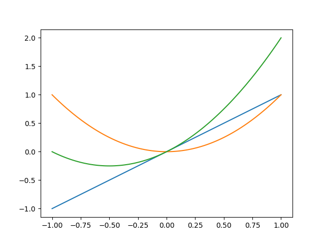
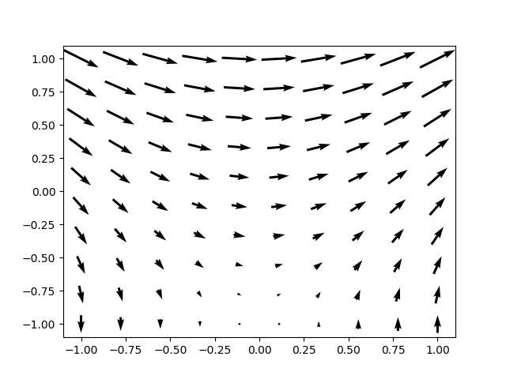

# vectorCalc
A repository for visulatizing, manipulating and working with objects in vector calculus.

The goal of this library is to make it as easy and natural as possible to do vector calculus, just as you would on paper. This is done by implementing classes for the different objects one uses, like scalars, 1D functions or 3D vector functions. The classes should contain ways to add, multiplicate or even differentiate them, as well as ways to visualize them.

As an example, you instantiate and add two functions by

    f = Function(lambda x: x)
    g = Function(lambda x: x**2)
    h = f + g

To see the result, use the `.plot()` method together with `pyplot`: 

    fig, ax = plt.subplots()
    f.plot(ax)
    g.plot(ax)
    h.plot(ax)
    plt.savefig("figs/functionAddition.png")

This syntax is consistent across different types. Take for example `fieldVector2D`, wich is a function that takes in two coordinates, and outputs a 2D vector (read more about it in fields.pdf): 

    f = lambda x: np.array([x[1],  x[0]])
    g = lambda x: np.array([np.ones_like(x[0]), np.zeros_like(x[0])])
    f = FieldVector2D(f)
    g = FieldVector2D(g)
    h = f + g

    fig, ax = plt.subplots()
    h.plot(ax)
    plt.savefig("figs/vectorfield_plot")

